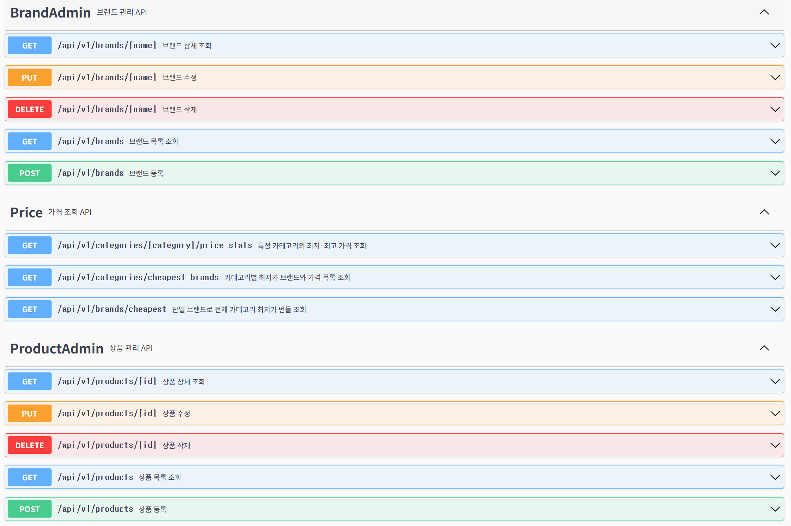

# MUSINSA Backend Assignment API

무신사 백엔드 엔지니어 과제용 **카테고리‑별 / 브랜드‑별 가격 조회 서비스** 구현체입니다.

---

## 📦 프로젝트 구조

```
com.musinsa
 ├─ controller   – REST API (Price·Brand·Product)
 ├─ service      – 도메인 로직 (PriceService etc.)
 ├─ repository   – Spring Data JPA
 ├─ domain       – JPA 엔티티 & Enum
 ├─ dto          – API 전용 DTO(record)
 ├─ common       – 공통 예외·응답·헬퍼
 └─ frontend     – frontend관련 코드
```

---

## 🚀 빌드 & 실행

```bash
# 1) clone
git clone https://github.com/sevity/musinsa-backend-assignment
cd musinsa-backend-assignment

# 2) test (unit + slice + integration)
chmod +x gradlew
./gradlew clean test

# 3) run (in‑memory H2)
./gradlew bootRun

# 4) frontend run
cd frontend
pnpm i  # or npm i / yarn
pnpm dev
http://localhost:3000/admin 
```

> H2 콘솔: `http://localhost:8080/h2-console`  
> JDBC URL: `jdbc:h2:mem:testdb`

초기 데이터는 `data.sql`(없으면 직접 Brand API 호출)로 주입됩니다.

---

## 🖥 Swagger / OpenAPI

모든 엔드포인트·DTO는 `@Operation`, `@Schema` 주석으로 문서화돼 있으며,

애플리케이션 기동 후 아래 URL에서 확인할 수 있습니다.

| URL | 설명 |
|-----|-----|
| `/swagger-ui/index.html` | Swagger UI |
| `/v3/api-docs` | OpenAPI 3 JSON |

에러 응답도 `ErrorResponse` 모델로 스키마화하여 문서로 확인 가능합니다.

---

## 🔗 API 명세

공통 Prefix : `/api/v1`


### 🔔 Error Handling

모든 실패 응답은 아래 형식을 사용합니다.

```json
{
  "status": 404,
  "code": "BRAND_NOT_FOUND",
  "message": "브랜드를 찾을 수 없습니다."
}
```

| Enum                       | HTTP | 기본 메시지                                                   |
|---------------------------|------|---------------------------------------------------------------|
| `BRAND_NOT_FOUND`         | 404  | 브랜드를 찾을 수 없습니다.                                     |
| `CATEGORY_NOT_FOUND`      | 404  | 카테고리를 찾을 수 없습니다.                                  |
| `BRAND_ALREADY_EXISTS`    | 409  | 이미 존재하는 브랜드입니다.                                   |
| `PRODUCT_NOT_FOUND`       | 404  | 상품을 찾을 수 없습니다.                                       |
| `PRODUCT_ALREADY_EXISTS`  | 409  | 해당 브랜드·카테고리 조합의 상품이 이미 존재합니다.            |
| `VALIDATION_ERROR`        | 400  | 요청 값이 유효하지 않습니다.                                   |
| `INTERNAL_ERROR`          | 500  | 서버 오류가 발생했습니다.   

> `ErrorCode` enum 에 **HTTP 상태, 에러 코드, 기본 메시지**를 한꺼번에 정의하고,  
> 서비스 레이어에서 `throw new ApiException(ErrorCode.BRAND_NOT_FOUND);` 처럼 사용합니다.  
> `GlobalExceptionHandler` 가 이를 받아 위 형식으로 직렬화합니다.

---

### 구현1) 카테고리 별 최저가격 브랜드와 상품 가격, 총액을 조회

```
GET /categories/cheapest-brands
```

```json
{
  "items":[
    {"category":"상의","brand":"C","price":10000},
    {"category":"아우터","brand":"E","price":5000},
    ...
  ],
  "total":34100
}
```

### 구현2) 단일 브랜드로 모든 카테고리 상품을 구매할 때 최저가격에 판매하는 브랜드와 카테고리의 상품가격, 총액을 조회하는 API

```
GET /brands/cheapest
```

```json
{
  "brand": "D",
  "categories": [
    {"category": "바지", "price": 3000},
    {"category": "모자", "price": 1500},
    ...
  ],
  "total": 36100
}
```
### 구현3) 카테고리 이름으로 최저, 최고 가격 브랜드와 상품 가격을 조회하는 API

```
GET /categories/{category}/price-stats
```

| Path variable | 설명      |
|---------------|-----------|
| `category`    | 카테고리명 |

#### 응답 예시 – `category = 상의`


```json
{
  "category": "상의",
  "lowest": [
    {"brand": "C", "price": 10000}
  ],
  "highest": [
    {"brand": "I", "price": 11400}
  ]
}
```


### 구현4) 브랜드 및 상품을 추가/조회/수정/삭제하는 API

| Method | Path                         | 설명                             |
|--------|------------------------------|----------------------------------|
| POST   | `/api/v1/brands`             | 신규 브랜드 등록                 |
| GET    | `/api/v1/brands`             | 브랜드 이름 목록 조회            |
| GET    | `/api/v1/brands/{name}`      | 브랜드 상세 조회 (카테고리별 가격) |
| PUT    | `/api/v1/brands/{name}`      | 카테고리별 가격 수정             |
| DELETE | `/api/v1/brands/{name}`      | 브랜드 삭제                      |
| POST   | `/api/v1/products`           | 신규 상품 등록                   |
| GET    | `/api/v1/products`           | 상품 목록 조회                   |
| GET    | `/api/v1/products/{id}`      | 상품 상세 조회                   |
| PUT    | `/api/v1/products/{id}`      | 상품 가격 수정                   |
| DELETE | `/api/v1/products/{id}`      | 상품 삭제                        |


**요청 예시 – 브랜드 등록**

```http
POST /api/v1/brands
Content-Type: application/json

{
  "brand": "Z",
  "prices": {
    "상의": 10000,
    "아우터": 5000,
    "바지": 3000,
    "스니커즈": 9000,
    "가방": 2000,
    "모자": 1500,
    "양말": 1700,
    "액세서리": 1900
  }
}
```

---
## 🚀 Frontend 하이라이트
```
root
└─ frontend/              # Next.js 14 App Router 프로젝트
    ├─ app/               # admin·categories UI 라우트
    ├─ lib/               # api.ts, queryClient.ts, categories.ts, constants.ts …
    └─ tailwind.config.ts # Tailwind
```


| 기능 | 상세 |
|------|------|
| **브랜드 / 상품 CRUD** | 등록·수정·삭제… 6 개 탭 분리, 드롭다운 자동 로드, 가격 세트 일괄 입력 |
| **통계 뷰어** | 카테고리별 최저가, 브랜드별 통합 최저가, 카테고리 Price-Stats 조회 UI |
| Tailwind UI |  모바일 반응형, 버튼 유틸 `.btn-primary` 등 |


---


## 🧪 테스트

| 구분 | 주요 대상 | 비고 |
|------|-----------|------|
| **Unit** | Service / Controller | Mockito + MockMvc + AssertJ |
| **Slice (@DataJpaTest)** | `BrandRepository`, `ProductRepository` | 실제 H2 SQL 로 커스텀 쿼리, 유니크 제약, exists 검증 |
| **Integration (@SpringBootTest)** | API ↔︎ DB 전체 플로우 | 랜덤 포트 + TestRestTemplate + H2 (인메모리) |

주요 인티그레이션 시나리오
1. **Price Flow** : 더미 데이터 삽입 → 카테고리별/브랜드별 통계 API로 합계·최저가 검증
2. **Product CRUD Flow** : 상품 생성 → 가격 수정(204) → 삭제 후 DB 존재 여부 확인

> `./gradlew test` 한 번으로 **단위(Unit) → JPA Slice → 전구간(Integration)** 세 단계가 모두 실행됩니다.

---

## ⚙️ 설계 포인트

* **`PriceService` 알고리즘**
    * 카테고리별 최저가는 스트림 최소값 + 누적 합산
    * 단일 브랜드 최저가는 _full‑coverage_ 브랜드만 후보로 두고 O(N) 순회(브랜드 수 N)으로 계산 – 성능·가독성 균형
* **무결성**
    * `Product` 테이블 복합 유니크(`brand_id`,`category`) 로 중복 방지
    * 요청 단 Bean Validation + 서비스 단 중복 체크(MVCC 환경 레벨)
* **예외 처리**
    * `ApiException(status, message)` + `GlobalExceptionHandler` → 일관된 에러 JSON
* **트랜잭션** : 서비스 계층 `@Transactional` 로 CRUD 안정성 확보
* **확장성** : Enum `Category` 한글 ↔︎ 영문 매핑 + `fromKr()`으로 다국어 확장 가능

---

## 🛣️ 향후 개선 아이디어

1. **배치 데이터 초기화** : CSV 업로드 → 서비스 호출.
2. **Query 최적화** : Price 통계에 카테고리‑별 인덱스 추가, JPQL 쿼리.
3. **캐싱 & 모니터링** : Redis 캐싱 + Micrometer/Prometheus.
5. **Frontend** : React + Tailwind 로 결과표 UI (Optional).


